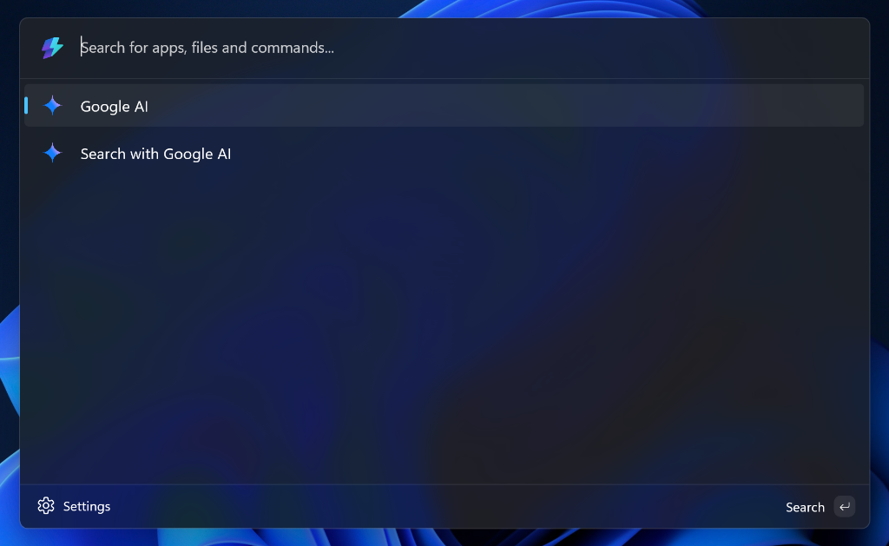
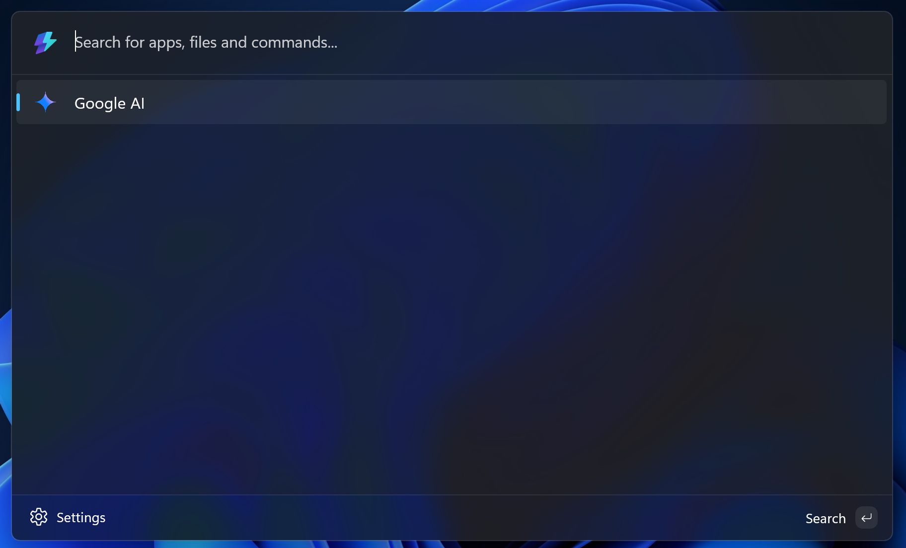

# Command Palette Gemini Extension

An extension for the Windows Powertoys Command Palette to search using Google's AI Mode.

_Select the "Google AI" command to start your query._

_Or simply type your query and use the fallback command._

---

## How to Install

The easiest way to install is using the pre-built release.

### 1. Download the Release
Download the latest `.msixbundle` and `.cert` for your platform from the [Releases Page](/releases).

### 2. Trust the Certificate
Because this extension is self-signed (not from the Microsoft Store), you must explicitly trust the certificate before Windows will let you install it.

**Certificate Thumbprint**: `166E061C C8611412 4E1BFB2E 7D83BAE6 9CE324B2`

1.  **Right-click** the downloaded certificate file.
2.  Select **Install Certificate**
3.  Select **Local Machine** and click **Next**.
4.  Select **"Place all certificates in the following store"**.
5.  Click **Browse...** and select **Trusted Root Certification Authorities**.
6.  Click **OK**, then **Next**, then **Finish**.

### 3. Install
Now that the certificate is trusted, simply **double-click** the `.msixbundle` file to install the extension.

Made with ❤️ by ConfusedHello
